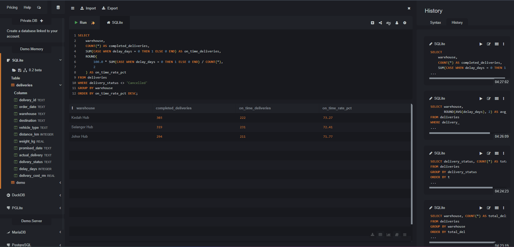
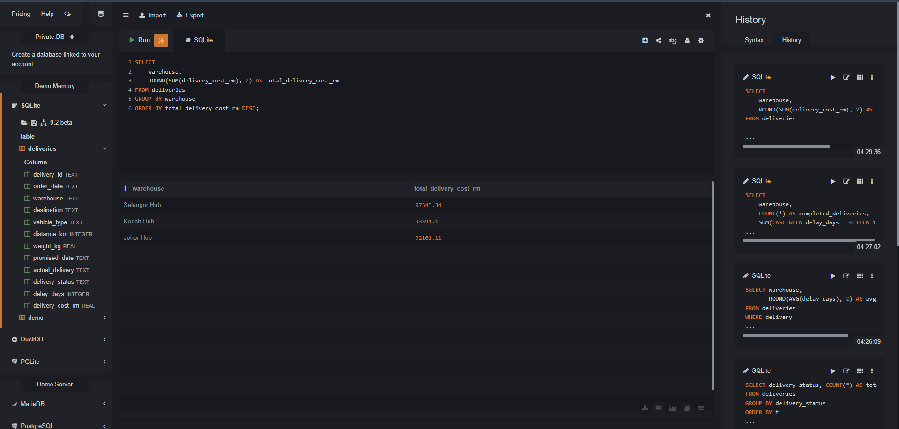

# Logistics Delivery Performance Analysis

## Project Overview
This is a personal SQL portfolio project using simulated logistics delivery data.

The objective of this project is to analyze delivery performance across multiple warehouse hubs, evaluate delivery status, identify operational delays, compare logistics costs, and measure on-time delivery performance.

## Tools Used
- SQL
- SQLite
- SQLiteOnline
- CSV Dataset

## Dataset
The dataset contains 1,000 simulated logistics delivery records.

Key fields include:
- Delivery ID
- Order Date
- Warehouse
- Destination
- Vehicle Type
- Distance (KM)
- Weight (KG)
- Promised Delivery Date
- Actual Delivery Date
- Delivery Status
- Delay Days
- Delivery Cost (RM)

## SQL Skills Demonstrated
- SELECT
- WHERE
- GROUP BY
- ORDER BY
- COUNT()
- SUM()
- AVG()
- ROUND()
- CASE WHEN
- Aggregate calculations
- Percentage calculations

## Analysis Performed
The SQL analysis covered:

- Delivery volume by warehouse
- Delivery status breakdown
- Average delivery delay by warehouse
- Top destinations by delivery volume
- Average delivery cost by vehicle type
- Total logistics cost by warehouse
- On-time delivery performance by warehouse

## Key Insights
- Selangor Hub recorded the highest delivery volume with 348 deliveries.
- 805 deliveries were classified as Delivered, 111 as Delayed, and 84 as Cancelled.
- Kedah Hub achieved the highest on-time delivery rate at 73.27%.
- Selangor Hub recorded the highest total delivery cost at RM97,343.34.

## On-Time Delivery Performance

The analysis uses conditional aggregation with `CASE WHEN` to calculate the number and percentage of on-time deliveries for each warehouse.

## Total Delivery Cost by Warehouse

The analysis uses `SUM()`, `ROUND()`, `GROUP BY`, and `ORDER BY` to compare total logistics expenditure across warehouse hubs.

## Project Files
- `logistics_analysis.sql` - SQL queries used for the analysis
- `logistics_delivery_data.csv` - Simulated logistics delivery dataset
- `SQL_OnTime_Performance.png` - On-time performance query and result
- `SQL_Total_Delivery_Cost.png` - Logistics cost query and result

## Note
This project was created for portfolio purposes using simulated data and does not represent data from a real company.
